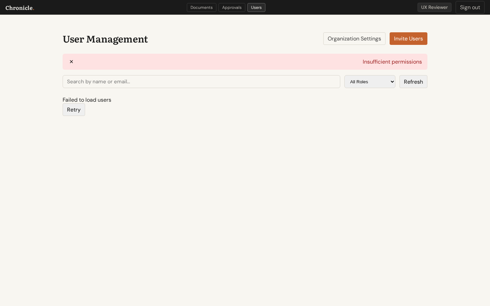
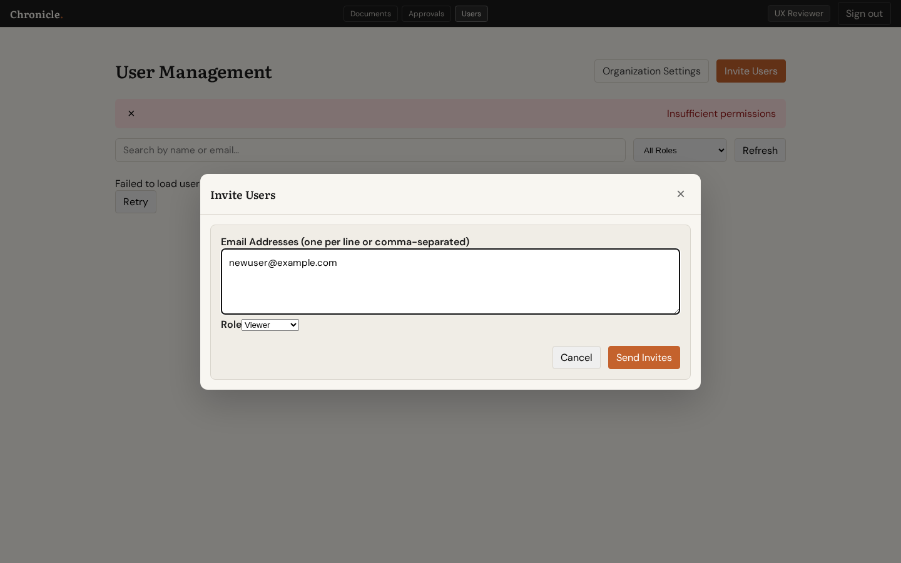

# UX Review: Add User Flow

**Issue:** #131 - User Management UX issues  
**Date:** 2026-02-28  
**Reviewer:** UX Review Agent  
**Test File:** `tests/e2e/ux-review-user-management.spec.ts` (Workflow 2)

---

## Summary

Tested the "Add New User" workflow ( Invite Users modal) and identified **7 UX issues**, including the 3 specific issues mentioned in #131. The modal is functional but lacks critical UX patterns for user guidance and feedback.

---

## Screenshots

### 1. User Directory - Initial State


**Observations:**
- ✅ "Invite Users" button is prominently displayed (orange/primary color)
- ❌ Error banner shows "Insufficient permissions" - confusing on initial load
- ❌ "Failed to load users" message with just a "Retry" button
- ❌ No empty state illustration or guidance

### 2. Invite Modal - Open State


**Observations:**
- ✅ Modal opens smoothly with overlay
- ✅ Clear title "Invite Users"
- ✅ Email textarea with helpful placeholder text
- ✅ Role selector visible
- ❌ **CRITICAL:** No role descriptions (Issue #131 - Item 1)
- ❌ No email validation indicators
- ❌ Cancel and Send Invites buttons present but no visual hierarchy distinction

### 3. Role Selector - Filled Form State


**Observations:**
- ✅ Email field accepts input
- ✅ Role dropdown shows "Viewer" as default
- ❌ **CRITICAL:** Still no role descriptions visible
- ❌ No preview of what permissions the selected role has

---

## Issues Found

### 🔴 High Severity

#### 1. Missing Role Descriptions (Issue #131)
**Location:** Invite Modal, Role Change Modal  
**Problem:** The role selector shows only labels ("Viewer", "Commenter", "Suggester", "Editor", "Admin") with no explanation of what each role can do. Users must guess or already know the permission hierarchy.

**Current:**
```
Role: [Viewer ▼]
```

**Recommended:**
```
Role: [Viewer ▼]
      Can view documents and comment
      
Options:
• Viewer — Can read documents and leave comments
• Commenter — Can read and comment, suggest changes
• Suggester — Can propose tracked changes for review
• Editor — Can edit documents and manage proposals  
• Admin — Full workspace management access
```

**Impact:** Users may invite people with wrong permissions, requiring follow-up corrections.

---

#### 2. No Email Validation Feedback (Related to Issue #131 - Item 6)
**Location:** Invite Modal - Email textarea  
**Problem:** The form accepts any text input without validating email format. Users only find out about invalid emails after submission fails.

**Current Behavior:**
- Type "invalid-email" → No visual feedback
- Click "Send Invites" → Server error or silent failure

**Recommended:**
- Real-time email validation as user types
- Visual indicators (green checkmark for valid, red outline for invalid)
- Inline error message: "Please enter valid email addresses"

---

#### 3. Search Lacks Debounce (Issue #131 - Item 3)
**Location:** User Directory - Search input  
**Problem:** The search input triggers API calls on every keystroke without debounce. Typing "alice" fires 5 separate API requests.

**Code Evidence:**
```typescript
// Line 193-196 in UserManagementPage.tsx
<input
  value={search}
  onChange={(e) => setSearch(e.target.value)}  // Triggers immediate re-render
  // No debounce implementation
/>
```

**Recommended:** Add 300ms debounce before triggering `loadUsers()`

---

### 🟡 Medium Severity

#### 4. No Helpful Empty State (Issue #131 - Item 4)
**Location:** User Directory  
**Problem:** When no users match search/filter criteria, the table shows headers with no rows and a generic "Failed to load users" message.

**Current:**
```
Failed to load users
[Retry]
```

**Recommended:**
```
📭 No users found

Try adjusting your search or filters:
• Check your spelling
• Clear the search box
• Select "All Roles" from the filter

[Clear Filters]
```

---

#### 5. Unclear Error on Initial Load
**Location:** User Directory  
**Problem:** "Insufficient permissions" error appears on initial page load even when user has admin role. This is confusing and suggests a bug.

**Possible Cause:** Race condition between auth state initialization and API call.

---

#### 6. Role Selector Layout Issue
**Location:** Invite Modal  
**Problem:** The "Role" label and dropdown are on the same line with no spacing, appearing cramped.

**Current:**
```
RoleViewer [▼]
```

**Recommended:**
```
Role
[Viewer                    ▼]
```

---

### 🟢 Low Severity

#### 7. Missing Confirmation for Invite Success
**Location:** Invite Modal  
**Problem:** After successfully sending invites, the modal closes immediately with only a brief toast message. Users may not be sure the action completed.

**Recommended:** Show a success state within the modal before closing:
```
✅ Invites sent!

3 invitations sent to:
• user1@example.com
• user2@example.com  
• user3@example.com

[Send More] [Close]
```

---

## Specific Checks for Issue #131

| Requirement | Status | Notes |
|-------------|--------|-------|
| Role descriptions shown? | ❌ FAIL | No descriptions visible in invite or role change modals |
| Debounce on search? | ❌ FAIL | No debounce - API called on every keystroke |
| Helpful empty state? | ❌ FAIL | Generic "Failed to load users" message, no guidance |

---

## Recommendations Summary

### Immediate (High Priority)
1. **Add role descriptions** - Add helper text below role selector explaining each role's permissions
2. **Implement email validation** - Validate email format before submission with visual feedback
3. **Add search debounce** - 300ms delay before triggering search API

### Short Term (Medium Priority)  
4. **Create helpful empty states** - Design empty state illustrations with actionable guidance
5. **Fix initial load error** - Investigate and fix the "Insufficient permissions" flash on load

### Polish (Low Priority)
6. **Improve role selector layout** - Better spacing and visual hierarchy
7. **Add invite success confirmation** - Show success state before closing modal

---

## Positive Findings

✅ **Invite button is prominent** - Orange primary button is easy to find  
✅ **Modal opens smoothly** - Clean overlay transition  
✅ **Form fields are clearly labeled** - "Email Addresses" label is descriptive  
✅ **Submit button is prominent** - "Send Invites" uses primary button style  
✅ **Multiple invite support** - Textarea allows bulk entry (comma or newline separated)

---

## Appendix: Code References

### UserManagementPage.tsx Lines of Interest

| Line | Issue |
|------|-------|
| 14-28 | Role labels and colors defined, but no descriptions |
| 98 | `window.confirm()` for deactivation (Issue #131 Item 2) |
| 111-141 | Bulk invite logic without email validation |
| 193-198 | Search input without debounce |
| 351-361 | Role selector without descriptions |
