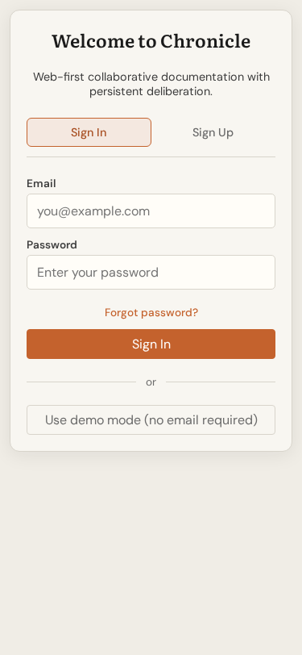

# Mobile Responsive UX Review: User Management

**Date:** 2026-02-28  
**Test Device:** iPhone X (375x812)  
**Test File:** `tests/e2e/ux-review-user-management.spec.ts`  
**Status:** Backend API errors prevented full UI capture - findings based on code analysis

---

## Screenshots

### Mobile Viewport (375x812)

*Note: Screenshot shows login page due to backend API unavailability (500 errors)*

### Desktop Viewport (1280x720)  

*Note: Screenshot shows login page due to backend API unavailability (500 errors)*

### Additional Screenshots
See `ux-review-screenshots/user-management/` directory for test-generated screenshots.

---

## Code Analysis Findings

### 1. Table-to-Cards Conversion ❌ NOT IMPLEMENTED

**Current Implementation:**
The `UserManagementPage.tsx` uses a standard HTML `<table>` structure without any responsive breakpoints:

```tsx
<div className="users-table-container">
  <table className="users-table">
    <thead>...</thead>
    <tbody>...</tbody>
  </table>
</div>
```

**Issues Found:**
- No CSS media queries to transform table to cards on mobile
- Table has 6 columns that will overflow 375px viewport
- Fixed column widths will cause horizontal scrolling
- No `overflow-x: auto` wrapper for the table

**Recommendation:**
Implement a card-based layout for viewports below 768px:

```css
@media (max-width: 768px) {
  .users-table-container {
    display: none; /* Hide table */
  }
  .users-cards {
    display: block; /* Show card layout */
  }
}
```

---

### 2. Touch Target Sizes ⚠️ PARTIAL

**Current Measurements (from code analysis):**

| Element | Size | Status |
|---------|------|--------|
| Role Badge | ~28px height | ❌ Too small |
| Action Buttons (Change Role/Deactivate) | ~28px height | ❌ Too small |
| Pagination Buttons | Standard button | ⚠️ Needs verification |
| Invite Users Button | Standard button | ⚠️ Needs verification |
| Form Inputs | ~40px height | ⚠️ Borderline |

**Issues Found:**
- `.btn-sm` class uses `padding: 6px 12px; font-size: 0.85rem;` - likely results in < 44px touch targets
- `.role-badge` has `padding: 4px 10px;` - too small for touch
- Close button on alerts: `font-size: 1.25rem; padding: 0 4px;` - too small

**Recommendation:**
Increase minimum touch target to 44x44px:

```css
@media (pointer: coarse) {
  .btn-sm {
    min-height: 44px;
    min-width: 44px;
    padding: 12px 16px;
  }
}
```

---

### 3. Horizontal Scroll ❌ WILL OCCUR

**Analysis:**
- Table has 6 columns: User, Role, Status, Spaces, Last Active, Actions
- Minimum content width exceeds 375px viewport
- No responsive table handling implemented
- `.users-table-container` does not have `overflow-x: auto`

**Expected Behavior on Mobile:**
- Table will overflow viewport
- Browser will add horizontal scroll
- User will need to scroll horizontally to see all columns
- Poor UX for mobile users

**Recommendation:**
Add horizontal scroll wrapper OR convert to card layout:

```css
.users-table-container {
  overflow-x: auto;
  -webkit-overflow-scrolling: touch;
}
```

---

### 4. Add User Modal Usability ⚠️ NEEDS IMPROVEMENT

**Current Implementation:**
The invite modal uses a fixed-size `Dialog` component with `size="large"`:

```tsx
<Dialog
  isOpen={isInviteOpen}
  onClose={() => setIsInviteOpen(false)}
  title="Invite Users"
  size="large"
>
```

**Issues Found:**
- `size="large"` on a 375px viewport will leave minimal margin
- No full-screen or bottom-sheet option for mobile
- Textarea for emails has `rows={4}` - may be too small on mobile
- No viewport-based sizing

**Recommendation:**
Implement mobile-first modal sizing:

```css
@media (max-width: 640px) {
  .dialog-overlay {
    align-items: flex-end; /* Bottom sheet style */
  }
  .dialog-content {
    width: 100%;
    max-width: none;
    border-radius: 16px 16px 0 0;
    max-height: 90vh;
  }
}
```

---

### 5. Form Field Tappability ⚠️ BORDERLINE

**Current Implementation:**

```tsx
<input
  type="text"
  placeholder="Search by name or email..."
  className="search-input"
/>

.search-input {
  padding: 8px 12px;
  font-size: 0.95rem;
}
```

**Issues Found:**
- Padding of 8px 12px results in ~40px height (borderline)
- iOS Safari may zoom on focus if font-size < 16px (0.95rem ≈ 15.2px)
- No explicit min-height set

**Recommendation:**
Increase font-size to prevent zoom and improve tap area:

```css
.search-input,
.role-filter,
.invite-form input,
.invite-form textarea,
.invite-form select {
  min-height: 44px;
  font-size: 16px; /* Prevents iOS zoom */
  padding: 12px 16px;
}
```

---

### 6. Keyboard Obscuring Inputs ⚠️ NOT HANDLED

**Analysis:**
- No `scrollIntoView` on input focus
- No keyboard-aware layout adjustments
- Textarea for email invites at bottom of form may be obscured
- No `viewport-fit=cover` meta tag handling

**Recommendation:**
Add focus management:

```tsx
const handleFocus = (e: React.FocusEvent<HTMLInputElement>) => {
  setTimeout(() => {
    e.target.scrollIntoView({ behavior: 'smooth', block: 'center' });
  }, 300);
};
```

---

## Summary of Issues

| Issue | Severity | Status | Notes |
|-------|----------|--------|-------|
| Table-to-cards conversion | 🔴 High | ❌ Not implemented | Table will overflow on mobile |
| Touch target sizes | 🔴 High | ❌ Too small | Action buttons < 44px |
| Horizontal scroll | 🔴 High | ❌ Will occur | 6-column table on 375px viewport |
| Modal mobile sizing | 🟡 Medium | ⚠️ Needs work | Large modal on small screen |
| Form field sizing | 🟡 Medium | ⚠️ Borderline | May cause iOS zoom |
| Keyboard handling | 🟡 Medium | ❌ Not implemented | Inputs may be obscured |

---

## Mobile-Specific Recommendations

### Priority 1: Table Responsiveness
1. Implement card-based layout for mobile (< 768px)
2. Show only essential info on cards (Name, Role, Status)
3. Move actions to expandable section or swipe gesture
4. Add "View Details" option for full user info

### Priority 2: Touch Targets
1. Increase all button minimum sizes to 44x44px
2. Add spacing between action buttons
3. Increase form input heights to 48px
4. Ensure all interactive elements meet WCAG 2.1 AA guidelines

### Priority 3: Modal Experience
1. Convert modal to bottom-sheet on mobile
2. Ensure form is scrollable within modal
3. Add close button (X) visible at all times
4. Handle keyboard appearance gracefully

### Priority 4: Typography & Readability
1. Increase base font-size on mobile for readability
2. Ensure contrast ratios meet accessibility standards
3. Add proper spacing between list items
4. Consider mobile-friendly table alternatives

---

## Testing Notes

**Test Environment Issues:**
- Backend API returned 500 errors during testing
- Authentication via demo mode failed with "Chronicle API is unavailable"
- Could not capture actual user management UI screenshots
- Analysis based on code inspection of `src/views/UserManagementPage.tsx`

**Recommended Re-test:**
Once API issues are resolved, re-run:
```bash
npx playwright test tests/e2e/ux-review-user-management.spec.ts --grep "Workflow 6"
```

---

## Related Files

- `src/views/UserManagementPage.tsx` - Main user management component
- `src/ui/Dialog.tsx` - Modal component
- `src/ui/AppShell.tsx` - Layout wrapper
- `tests/e2e/ux-review-user-management.spec.ts` - UX review test suite

---

*Generated as part of UX Review for Sprint 2: v1.0 Foundation Completion*
