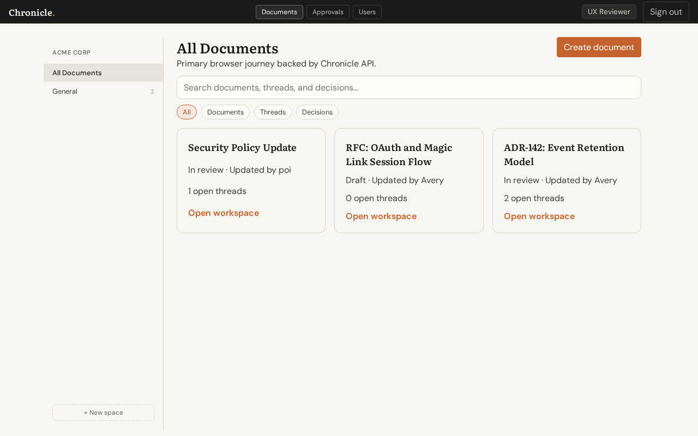
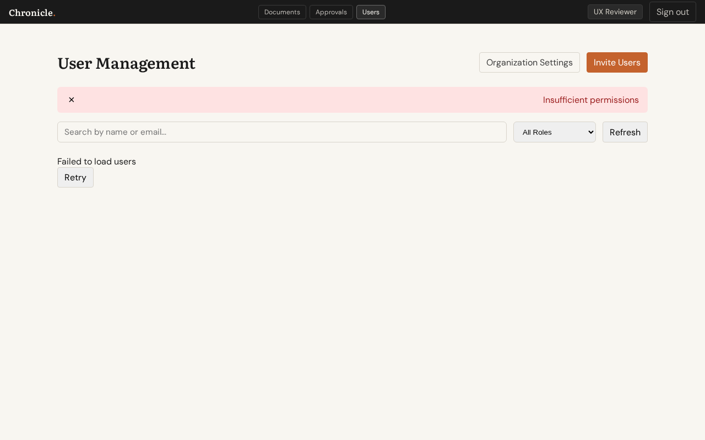
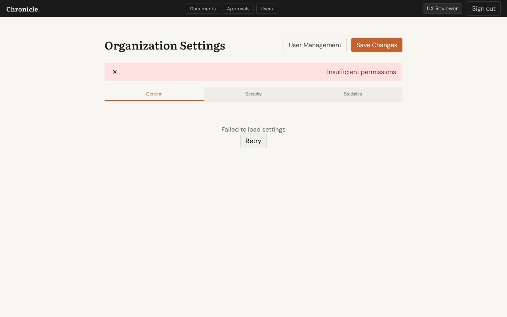
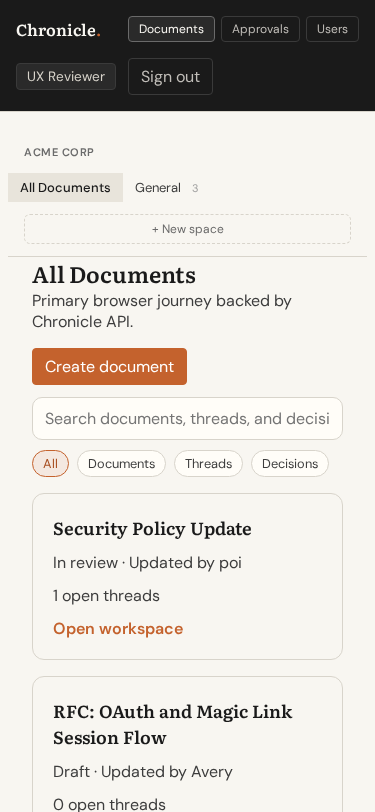

# UX Review: Admin Navigation & Settings

**Issues Reviewed:**
- Issue #130 - Admin area has no unified navigation
- Issue #128 - My Organization Settings Page

**Test Date:** 2026-02-28  
**Reviewer:** UX Review Agent  
**Test File:** `tests/e2e/ux-review-user-management.spec.ts -g "Workflow 5"`

---

## Executive Summary

The admin navigation and settings areas are **partially implemented but have significant discoverability and structural issues**. While the core pages exist (`/admin/users` and `/settings/organization`), they lack a unified navigation structure and are not easily discoverable from the main application interface.

**Severity:** Medium-High  
**Impact:** Admin users will struggle to find settings and navigate between admin functions

---

## Screenshots

### 1. Main Navigation (Documents Page)


The main navigation shows three items:
- **Documents** - Main document listing
- **Approvals** - Approval workflow dashboard  
- **Users** - Admin user management page

### 2. User Menu Area (Header Detail)


The user navigation area shows:
- User name as a text chip ("UX Reviewer")
- Sign out button
- **NO user avatar**
- **NO dropdown menu**
- **NO Settings link**

### 3. Admin Users Page


The User Management page shows:
- Page title "User Management"
- "Organization Settings" button (secondary)
- "Invite Users" button (primary)
- Search and filter controls
- **NO breadcrumbs**
- **NO unified admin navigation sidebar/menu**

*Note: "Insufficient permissions" error is expected in demo mode - backend requires real admin role.*

### 4. Organization Settings Page


The Organization Settings page shows:
- Page title "Organization Settings"
- "User Management" button to navigate back
- "Save Changes" button (primary)
- Tab navigation: General, Security, Statistics
- **NO breadcrumbs**
- Clean tab-based navigation between settings categories

### 5. Mobile Navigation


Mobile viewport shows:
- Navigation items wrap to fit screen
- **NO hamburger menu or collapsible navigation**
- Navigation takes significant vertical space
- User menu still visible

### 6. Settings Tab Navigation (Security Tab)


Tab navigation works correctly:
- Clear active tab indicator
- Easy switching between categories
- Consistent header actions across tabs

---

## Navigation Flow Diagram

```
┌─────────────────────────────────────────────────────────────────┐
│  HEADER NAVIGATION (All Pages)                                   │
│  ┌──────────┐  ┌──────────┐  ┌──────────┐  ┌─────────────────┐ │
│  │Documents │  │Approvals │  │  Users   │  │ UX Reviewer │Sign out│
│  └────┬─────┘  └────┬─────┘  └────┬─────┘  └─────────────────┘ │
│       │             │             │                              │
│       ▼             ▼             ▼                              │
│  ┌─────────┐  ┌──────────┐  ┌──────────────┐                    │
│  │/documents│  │/approvals│  │/admin/users  │                    │
│  └─────────┘  └──────────┘  └──────┬───────┘                    │
│                                    │                             │
│                     ┌──────────────┘                             │
│                     ▼                                            │
│           ┌──────────────────┐                                  │
│           │ Organization     │  ◄── Secondary button only       │
│           │ Settings         │                                  │
│           └────────┬─────────┘                                  │
│                    │                                             │
│                    ▼                                             │
│           ┌──────────────────┐                                  │
│           │ /settings/       │                                  │
│           │ organization     │                                  │
│           └──────────────────┘                                  │
│                                                                 │
│  REVERSE NAVIGATION (Settings → Users):                         │
│  ┌─────────────────────────────────────────────────────────┐   │
│  │ "User Management" button in settings page header         │   │
│  └─────────────────────────────────────────────────────────┘   │
└─────────────────────────────────────────────────────────────────┘
```

---

## Issues Found

### 🔴 Critical: Issue #130 - Admin Navigation is Fragmented

| Problem | Evidence | Impact |
|---------|----------|--------|
| **No unified "Admin" section** | Users and Settings are separate top-level concepts | Users don't know where to find admin functions |
| **Settings is buried** | Must go Users → Organization Settings | 2-click navigation to reach settings |
| **No Settings in user menu** | User menu only shows name + Sign out | No standard pattern for accessing settings |
| **No visual hierarchy** | Admin links look identical to regular nav | Can't distinguish admin vs user functions |
| **No breadcrumbs** | Neither Users nor Settings pages show breadcrumbs | Users lose context of where they are |

**Specific Evidence:**
- Main nav shows "Users" but not "Admin" or "Settings"
- Organization Settings is only reachable via a secondary button on User Management
- No avatar or settings icon in the user menu area
- Mobile view has no collapsible admin menu

### 🟡 Medium: Issue #128 - Settings Page Layout Issues

| Problem | Evidence | Impact |
|---------|----------|--------|
| **Settings undiscoverable** | No direct link to `/settings/organization` | Users can't find settings without knowing URL |
| **No user profile settings** | Only Organization Settings exists | Users can't manage their own profile/password |
| **Tab navigation is good** | Clear General/Security/Statistics tabs | ✅ This works well |
| **Save action is prominent** | Orange "Save Changes" button visible | ✅ Good visibility |

### 🟡 Medium: Mobile Navigation Issues

| Problem | Evidence | Impact |
|---------|----------|--------|
| **No mobile-optimized nav** | Nav items wrap but don't collapse | Takes excessive vertical space |
| **Touch targets appear small** | Nav buttons are compact | May be hard to tap accurately |
| **No hamburger menu** | All nav items always visible | Cluttered interface on small screens |

---

## Recommendations

### 1. Create Unified Admin Navigation (Addresses #130)

**Option A: Admin Dropdown in Main Nav (Recommended)**
```
┌─────────────────────────────────────────────────────────┐
│  Documents │ Approvals │ [Admin ▼] │     [Avatar ▼]    │
│                         ├─ User Management              │
│                         ├─ Organization Settings        │
│                         ├─ Space Permissions            │
│                         └─ Audit Log                    │
└─────────────────────────────────────────────────────────┘
```

**Option B: Settings Icon in User Menu**
```
┌─────────────────────────────────────────────────────────┐
│  Documents │ Approvals │ Users │    [Avatar ▼]         │
│                                     ├─ Profile          │
│                                     ├─ Settings         │
│                                     └─ Sign out         │
└─────────────────────────────────────────────────────────┘
```

### 2. Add Breadcrumbs (Addresses #130)

```
Home / Admin / User Management
Home / Admin / Organization Settings / Security
```

### 3. Restructure Settings Navigation (Addresses #128)

Create a dedicated Settings area with:
- **Personal Settings** (profile, password, notifications)
- **Organization Settings** (current page)
- **Workspace Settings** (if applicable)

Access via:
- User avatar dropdown
- Direct URL `/settings`

### 4. Mobile Navigation Improvements

- Add hamburger menu for mobile
- Group admin items under "Admin" section
- Ensure touch targets are 44x44px minimum

### 5. Visual Hierarchy Improvements

- Use gear/settings icon for settings access
- Consider different styling for admin nav items
- Add section headers in sidebar for "Workspace" vs "Admin"

---

## Positive Findings

| Aspect | Status | Notes |
|--------|--------|-------|
| Tab navigation in settings | ✅ Good | Clear, easy to switch categories |
| Save button prominence | ✅ Good | Orange primary button is visible |
| Header action placement | ✅ Good | Actions in top-right are consistent |
| Link between Users ↔ Settings | ✅ Good | Bidirectional navigation exists |

---

## Files Referenced

- `src/ui/AppShell.tsx` - Main navigation structure
- `src/views/UserManagementPage.tsx` - Admin users page
- `src/views/OrganizationSettingsPage.tsx` - Settings page
- `tests/e2e/ux-review-user-management.spec.ts` - Test specification

## Related GitHub Issues

- Issue #130: Admin area has no unified navigation
- Issue #128: My Organization Settings Page

---

*Generated by UX Review Agent*  
*Do not commit - for review purposes only*
